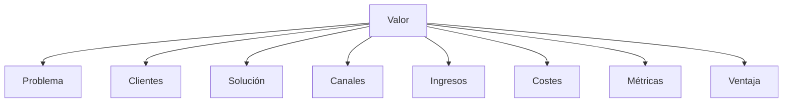
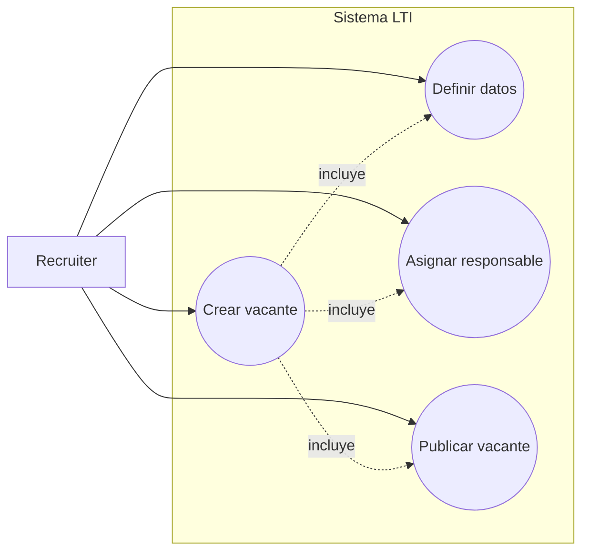
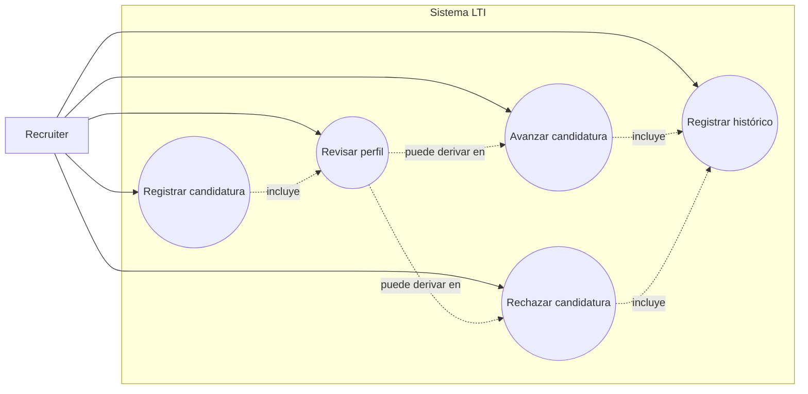
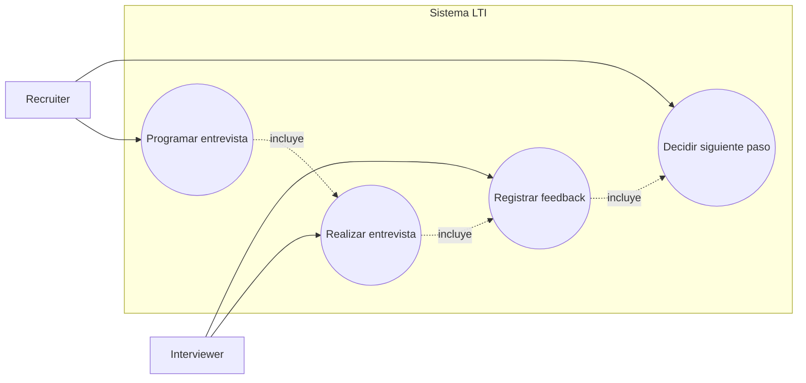
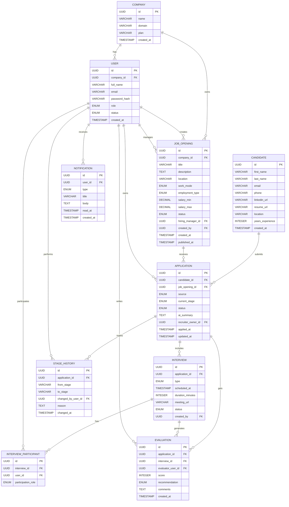
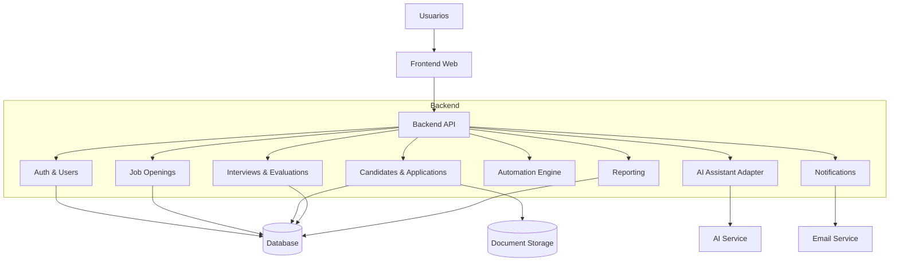
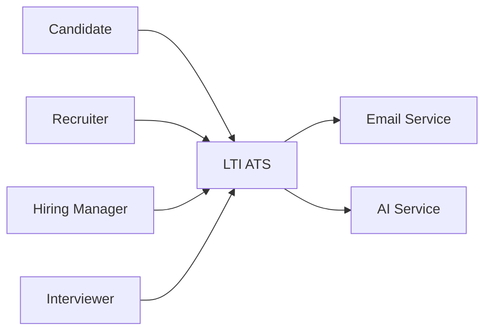
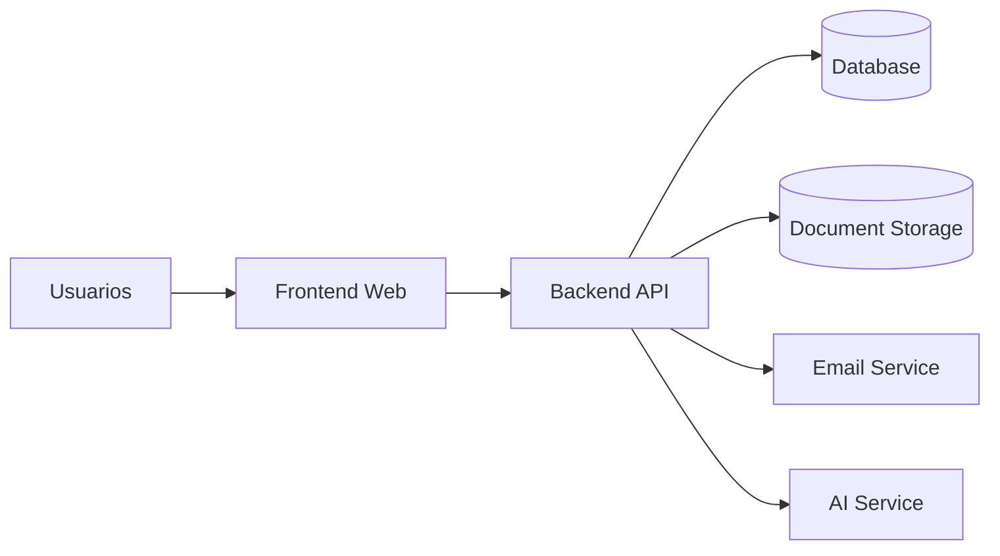
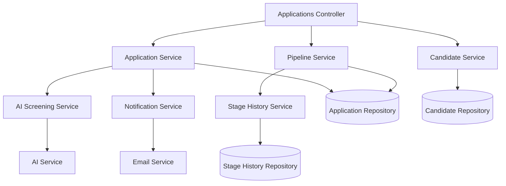

# LTI — Diseño inicial del sistema de gestión de candidatos

## 1. Introducción

Este documento describe el diseño de la primera versión de **LTI**, una plataforma SaaS de gestión de candidatos (ATS). El objetivo es definir una base sólida que permita gestionar el proceso completo de selección, facilitando la colaboración entre equipos de contratación y mejorando la eficiencia operativa.

El diseño prioriza simplicidad, claridad y capacidad de evolución, permitiendo iterar rápidamente sobre el producto a medida que se valida su uso en entornos reales.

---

## 2. Descripción del producto

### 2.1 Visión

LTI es una plataforma diseñada para centralizar y optimizar el proceso de contratación, proporcionando visibilidad completa del pipeline de selección y facilitando la toma de decisiones basada en información estructurada.

### 2.2 Problema

En muchas organizaciones, el proceso de selección está fragmentado en múltiples herramientas (emails, hojas de cálculo, calendarios), lo que genera:

- pérdida de información relevante;
- falta de trazabilidad del candidato;
- descoordinación entre recruiters y managers;
- lentitud en la toma de decisiones;
- alta carga operativa manual.

### 2.3 Propuesta de valor

LTI transforma el proceso de selección en un flujo estructurado, colaborativo y medible, permitiendo:

- centralizar toda la información del candidato;
- mejorar la coordinación entre equipos;
- reducir tiempos de contratación;
- automatizar tareas repetitivas;
- mejorar la calidad de las decisiones.

### 2.4 Ventajas competitivas

- Colaboración en tiempo real entre stakeholders del proceso  
- Pipeline visual y trazable de candidatos  
- Automatización de tareas operativas  
- Integración de capacidades de IA para soporte en screening y evaluación  
- Experiencia de usuario simple y rápida de adoptar

---

## 3. Funcionalidades principales

### 3.1 Gestión de vacantes

- Creación, edición y publicación de vacantes  
- Definición de requisitos, descripción y responsables  
- Gestión del estado (borrador, abierta, cerrada)

### 3.2 Gestión de candidaturas

- Registro de candidatos  
- Asociación a vacantes  
- Almacenamiento de CV y datos relevantes  
- Seguimiento del estado dentro del proceso

### 3.3 Pipeline de selección

- Flujo por etapas configurable  
- Visualización del estado de cada candidato  
- Historial de cambios

### 3.4 Gestión de entrevistas

- Programación de entrevistas  
- Asignación de entrevistadores  
- Registro de resultados

### 3.5 Evaluación colaborativa

- Feedback estructurado  
- Valoraciones cuantitativas y cualitativas  
- Consolidación de decisiones

### 3.6 Automatización

- Notificaciones de eventos relevantes  
- Recordatorios de entrevistas  
- Alertas de candidatos pendientes  
- Seguimiento de estados

### 3.7 Asistencia inteligente

- Resumen automático de CV  
- Extracción de información clave  
- Soporte en generación de feedback  
- Ayuda en screening inicial

### 3.8 Reporting

- Métricas de proceso de selección  
- Tiempo medio de contratación  
- Conversión entre etapas  
- Rendimiento de vacantes

---

## 4. Modelo de negocio (Lean Canvas)

| Bloque             | Descripción                                             |
| ------------------ | ------------------------------------------------------- |
| Problema           | Procesos de selección desorganizados y manuales         |
| Clientes           | Startups, pymes y equipos de HR                         |
| Propuesta de valor | Plataforma colaborativa e inteligente para contratación |
| Solución           | Gestión de vacantes, pipeline, entrevistas y evaluación |
| Canales            | Venta B2B, demos, marketing digital                     |
| Ingresos           | Suscripción SaaS                                        |
| Costes             | Desarrollo, infraestructura, soporte                    |
| Métricas           | Time-to-hire, conversión por etapa                      |
| Ventaja            | Simplicidad + automatización + IA                       |

---

## 5. Casos de uso principales

### 5.1 Crear y publicar vacante

Actor: Recruiter

Flujo:

Crear vacante
Definir datos
Asignar responsable
Publicar

### 5.2 Gestionar candidatura

Actor: Recruiter

Flujo:

Registrar candidatura
Revisar perfil
Avanzar o rechazar
Registrar histórico  

### 5.3 Entrevista y evaluación

Actores: Recruiter, Interviewer

Flujo:

Programar entrevista
Realizar entrevista
Registrar feedback
Decidir siguiente paso

---

## 6. Modelo de datos

### Entidades principales

Company

- id: UUID
- name: String

User

- id: UUID
- company_id: UUID
- email: String
- role: Enum

JobOpening

- id: UUID
- title: String
- status: Enum
- hiring_manager_id: UUID

Candidate

- id: UUID
- name: String
- email: String

Application

- id: UUID
- candidate_id: UUID
- job_id: UUID
- stage: Enum

Interview

- id: UUID
- application_id: UUID
- scheduled_at: DateTime

Evaluation

- id: UUID
- score: Integer
- comments: Text

---

## 7. Diseño del sistema a alto nivel

### 7.1 Enfoque arquitectónico

El sistema se diseña como un **monolito modular con separación clara entre frontend y backend**, desplegado como una aplicación web SaaS.

Este enfoque permite:

- reducir la complejidad inicial del sistema;
- acelerar el desarrollo y la iteración;
- mantener una base coherente del dominio;
- facilitar una futura evolución hacia arquitecturas distribuidas si el producto lo requiere.

El sistema se estructura siguiendo principios de **separación de responsabilidades**, organizando el backend en módulos de dominio independientes.

---

### 7.2 Componentes del sistema

#### Frontend

Aplicación web que permite a los usuarios interactuar con el sistema:

- gestión de vacantes;
- visualización del pipeline;
- evaluación de candidatos;
- gestión de entrevistas.

Se comunica exclusivamente con el backend mediante API.

---

#### Backend API

Encapsula toda la lógica de negocio del sistema y expone endpoints para el frontend.

Se organiza en los siguientes módulos:

- **Auth & Users**: gestión de usuarios, autenticación y roles  
- **Job Openings**: gestión de vacantes  
- **Candidates & Applications**: gestión de candidatos y pipeline  
- **Interviews & Evaluations**: entrevistas y feedback  
- **Notifications**: gestión de eventos y avisos  
- **Automation Engine**: ejecución de reglas automáticas  
- **AI Assistant Adapter**: integración con servicios de IA  
- **Reporting**: generación de métricas y análisis

---

#### Base de datos

Sistema de persistencia relacional encargado de almacenar:

- entidades principales del dominio;
- relaciones entre datos;
- histórico del proceso de selección.

---

#### Almacenamiento de documentos

Sistema externo para almacenar archivos como CVs y documentos adjuntos.

---

#### Servicio de notificaciones

Encargado de enviar comunicaciones:

- emails;
- notificaciones internas.

---

#### Servicio de IA

Componente externo o desacoplado que permite:

- análisis de CVs;
- generación de resúmenes;
- asistencia en evaluación.

---

### 7.3 Comunicación entre componentes

- El **frontend** interactúa con el sistema a través del **backend API**.
- El **backend** gestiona la lógica de negocio y accede a la base de datos.
- Los módulos internos del backend se comunican entre sí mediante llamadas internas.
- El backend se integra con:
  - almacenamiento de documentos;
  - servicio de notificaciones;
  - proveedor de IA.

---

### 7.4 Diagrama de arquitectura

---

## 8. Diagrama C4

Para describir la arquitectura con mayor nivel de detalle, se utiliza el modelo C4, profundizando en el componente de **gestión de candidaturas (Applications)**, que constituye el núcleo funcional del sistema.

---

### 8.1 Nivel 1 — Contexto

Representa el sistema en relación con usuarios y servicios externos.

### 8.2 Nivel 2 — Contenedores

Describe las principales piezas desplegables del sistema.

---

### 8.3 Nivel 3 — Componentes (Applications)

Se detalla el módulo encargado de la gestión de candidaturas

### 8.4 Justificación del componente seleccionado

El módulo de **candidaturas (Applications)** se considera el núcleo del sistema, ya que:

- conecta candidatos con vacantes;
- gestiona el estado del pipeline;
- almacena el histórico de decisiones;
- activa automatizaciones;
- integra capacidades de inteligencia artificial.

Este componente concentra la mayor parte del valor del sistema y actúa como punto central de coordinación entre el resto de módulos..